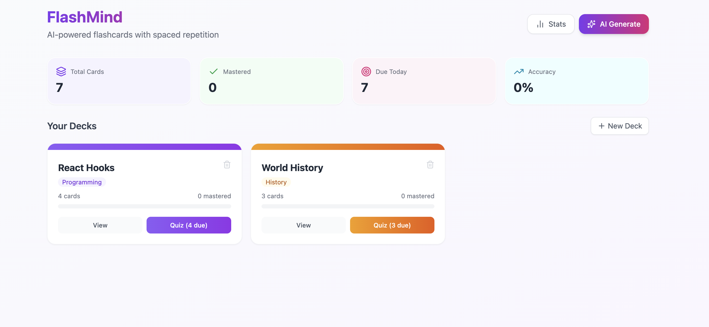

# FlashMind - AI-Powered Flashcard Generator

A modern, colorful flashcard app with AI-powered card generation and spaced repetition. Generate flashcards instantly from any topic or your own notes, then quiz yourself with flip cards or multiple choice - all while a smart algorithm makes sure you remember everything.



## Live Demo

## Features

- 🤖 AI-powered flashcard generation:
  - Generate flashcards by typing a topic
  - Or paste your own notes and AI creates cards from them
  - AI also suggests related topics to study next
- 🧠 Two quiz modes:
  - **Flip Cards** — Tap to reveal the answer
  - **Multiple Choice** — Pick from 4 options
- 🔄 Spaced Repetition (SM-2 Algorithm):
  - Cards you struggle with come back sooner
  - Cards you know well get spaced out over days
  - Tracks next review date for every card
- 📂 Deck Organization:
  - Create and manage multiple decks
  - Organize decks by subject
  - Color-coded decks for easy identification
- 📊 Progress & Analytics:
  - Track mastered vs learning cards
  - See accuracy rates
  - View cards due today
  - Bar charts showing progress per deck
  - Difficulty breakdown (Easy, Medium, Hard)
- 💾 Persistent data storage using localStorage
- 🎨 Colorful, vibrant UI with gradients and smooth transitions

## Tech Stack

- **Frontend:** React, Hooks (useState, useEffect)
- **Styling:** Tailwind CSS
- **Charts:** Recharts
- **Icons:** Lucide React
- **AI:** Claude API (Anthropic)
- **Algorithm:** SM-2 Spaced Repetition
- **Storage:** localStorage

## How It Works

- **Generate Cards:** Click "AI Generate", type a topic or paste notes, choose how many cards you want, and AI creates flashcards with questions, answers, explanations, and difficulty levels
- **Organize:** Create decks and sort them by subject. Add AI-generated cards to existing decks or create new ones automatically
- **Quiz Yourself:** Pick a deck and choose between Flip or Multiple Choice mode. The app tracks which cards are due based on spaced repetition
- **Learn Smarter:** The SM-2 algorithm (used by Anki) adjusts how often you see each card based on how well you remember it. Cards you struggle with come back sooner, cards you know well get spaced out
- **Track Progress:** Visit the Stats page to see how many cards you've mastered, your accuracy, and a visual breakdown of your progress across all decks

## How the SM-2 Algorithm Works

The app uses the SM-2 spaced repetition algorithm to optimize your study sessions:

- When you get a card right, the interval before you see it again increases (1 day → 6 days → 12 days → ...)
- When you get a card wrong, it resets back to 1 day
- Each card has an "ease factor" that adjusts based on how difficult you find it
- Over time, easy cards are reviewed less often and hard cards are reviewed more often

## Installation

```bash
# Clone the repository
git clone https://github.com/Sid20025/flashcard-generator.git

# Go into the project folder
cd flashmind

# Install dependencies
npm install

# Start the app
npm start
```

The app will open in your browser at http://localhost:3000

## What I Learned

- Implementing the SM-2 spaced repetition algorithm from scratch
- Working with the Claude AI API to generate structured flashcard data
- Managing complex state across multiple views (home, deck, quiz, stats)
- Building interactive quiz UI with flip cards and multiple choice logic
- Data visualization with Recharts for progress tracking
- Designing colorful, vibrant UI with Tailwind CSS gradients
- Persisting complex nested data structures with localStorage
- Prompt engineering to get AI to return structured JSON data reliably

## Future Improvements

- [ ] Backend API with Node.js and Express
- [ ] User authentication and login system
- [ ] Import flashcards from Anki or Quizlet
- [ ] Export decks as PDF or printable cards
- [ ] Image support on flashcards
- [ ] Audio support for language learning
- [ ] Study streaks and daily reminders
- [ ] Collaborative decks - share and study with friends
- [ ] Mobile app version with offline support
- [ ] Keyboard shortcuts for faster studying

## Author

Siddharth Aggarwal

- GitHub: https://github.com/Sid20025/
